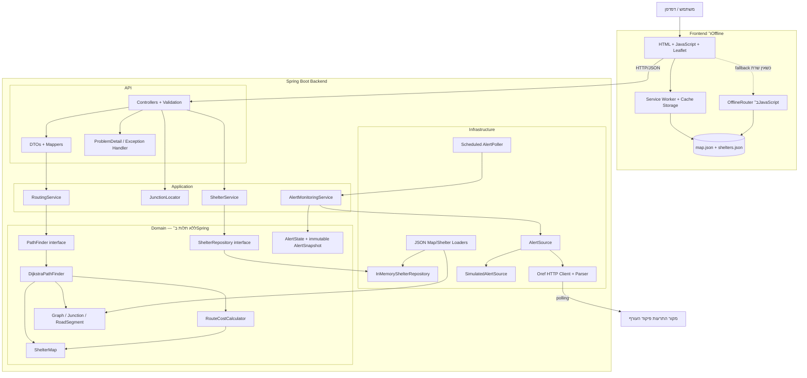
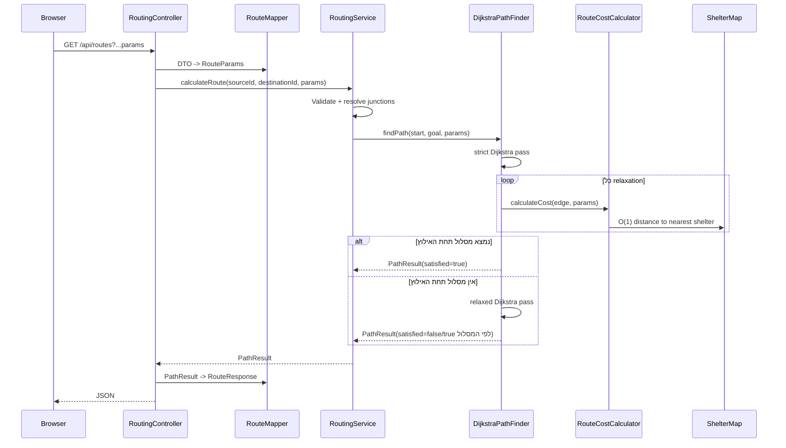

# FireRoute — הכנה לראיון פיתוח תוכנה

מסמך זה מתאר את המערכת כפי שהיא ממומשת כרגע, את החלטות התכנון, ה־trade-offs, המגבלות ושאלות ההמשך הסבירות בראיון.

## גרסת 30 שניות

FireRoute היא אפליקציית Java 21 ו־Spring Boot לניתוב הולכי רגל במרכז תל אביב, עם דגש על קרבה למקלטים. המפה מיוצגת כגרף מכוון. מסלול רגיל מחושב באמצעות Dijkstra עם פונקציית עלות שמשלבת זמן הליכה וחשיפה, ומסלול חירום משתמש במפת מרחקים למקלט שנבנית פעם אחת בעליית השירות באמצעות Dijkstra רב־מקורי על הגרף ההפוך. המערכת גם מנטרת התרעות ממקור מתחלף, ושומרת snapshot עקבי באמצעות reference מסוג `volatile` ועדכון `synchronized`, וחוזרת לניתוב מקומי בדפדפן כשהשרת אינו זמין.

## תרשים ארכיטקטורה



העיקרון המרכזי: התלויות פונות פנימה. ה־Domain מכיל את האלגוריתם והחוקים ואינו מכיר HTTP, JSON, Spring או את מקור ההתרעות החיצוני.

## זרימת בקשת מסלול רגיל



### למה שני מעברים?

המעבר הראשון מונע מעבר בצמתי ביניים הרחוקים מדי ממקלט. אם הוא נכשל, המעבר השני מחפש מסלול ללא הסינון. ההחלטה היא לא להשאיר משתמש בלי תשובה רק משום שנקודת המוצא שלו חשופה. התשובה כוללת `shelterConstraintSatisfied`, ולכן הלקוח יכול להזהיר במקום להציג מסלול חשוף כאילו הוא בטוח.

## זרימת מסלול חירום

```text
source junction
      │
      ▼
ShelterMap.getNearestShelter(source)       O(1)
      │
      ▼
מעקב אחר nextStepToShelter
      │
      ▼
nearest reachable shelter
```

מסלול החירום אינו מריץ Dijkstra חדש. הוא משתמש בתוצאות שחושבו מראש בתוך `ShelterMap`: המרחק למקלט, זהות המקלט והצעד הבא אליו.

## האלגוריתם המרכזי

### ייצוג הגרף

- `Junction` הוא צומת עם מזהה, קואורדינטות ורשימת כבישים יוצאים.
- `RoadSegment` הוא קשת מכוונת עם זמן הליכה.
- `Graph` מחזיק `HashMap<String, Junction>` כדי לאתר צומת לפי מזהה בזמן ממוצע `O(1)`.
- הנתונים נטענים מ־`map.json` בעליית השירות ונשארים בזיכרון.

### מסלול רגיל

`DijkstraPathFinder` משתמש ב־`PriorityQueue`. הסיבוכיות המקובלת היא:

```text
O((V + E) log V)
```

הקוד אינו מבצע decrease-key. במקום זאת הוא מכניס רשומה חדשה לתור, וכאשר רשומה ישנה יוצאת הוא מדלג עליה באמצעות `settledNodes`. זה מפשט את המימוש במחיר של רשומות כפולות זמניות בתור.

### פונקציית העלות

```text
cost(edge) = walkingMinutes
           + fearFactor × max(0, minutesToShelter(target) - 1.5)
```

המשמעות של `fearFactor`: כמה דקות הליכה נוספות המשתמש מוכן לשלם כדי לחסוך דקת חשיפה. כאשר הוא `0`, מתקבל המסלול המהיר ביותר; ככל שהוא גדל, האלגוריתם מעדיף להישאר קרוב למקלטים.

### למה Dijkstra עדיין חוקי?

כל רכיבי העלות אינם שליליים:

- זמן הליכה אינו שלילי.
- `fearFactor` עובר validation כערך שאינו שלילי.
- החשיפה נחתכת באמצעות `max(0, ...)`.

לכן אין קשת בעלת משקל שלילי, ותנאי היסוד של Dijkstra נשמר.

### ShelterMap — Dijkstra רב־מקורי

כדי לדעת לכל צומת מהו המקלט הקרוב, המערכת:

1. הופכת את כיוון כל הקשתות.
2. מכניסה את כל צמתי המקלט לתור העדיפויות עם מרחק `0`.
3. מריצה Dijkstra פעם אחת.
4. שומרת לכל צומת מרחק, מקלט קרוב וצעד הבא.

הגרף ההפוך נחוץ כי השאלה היא: "איך מגיעים מכל צומת אל מקלט?" התחלה מכל המקלטים על הגרף ההפוך פותרת את כל השאלות יחד.

```text
עלות בנייה: O((V + E) log V), פעם אחת בעלייה
שאילתת מרחק/מקלט: O(1)
שחזור מסלול חירום: O(length of path)
```

## זרימת ההתרעות ומקביליות

```mermaid
flowchart LR
    Scheduler[@Scheduled AlertPoller] --> Monitor[AlertMonitoringService]
    Monitor --> Contract[AlertSource interface]
    Contract --> Simulated[Simulated source]
    Contract --> Oref[Oref client + parser]
    Monitor --> State[volatile AlertSnapshot + synchronized writer]
    API[AlertController] --> State
    State --> Response[ACTIVE / QUIET / UNKNOWN + timestamps]
```

`AlertSnapshot` הוא record בלתי משתנה. כל ניסיון polling יוצר snapshot חדש. המתודה `record` היא `synchronized`, ולכן פעולת read-modify-write מוגנת בין writers; ההפניה היא `volatile`, ולכן request threads רואים את ה־snapshot החדש בשלמותו ללא נעילה בקריאה. כך קורא אינו רואה `status` חדש עם timestamps ישנים.

כשל ב־Oref הופך ל־`UNKNOWN`, לא ל־`QUIET`. בנוסף נשמר `lastKnownStatus`, כדי להבדיל בין "הקריאה האחרונה נכשלה" לבין "המצב התקין האחרון היה שקט".

## עבודה אופליין

ה־Service Worker שומר:

- app shell;
- `map.json`;
- `shelters.json`;
- נכסים חיצוניים ואריחי מפה שכבר נצפו, במידת האפשר.

כאשר `fetch` לשרת נכשל, `app.js` מעביר בקשות GET ל־`OfflineRouter` המקומי. הניתוב עצמו אינו תלוי באריחי המפה.

מגבלה חשובה: בלי תקשורת אי אפשר לקבל התרעה חדשה. לכן אופליין מספק יכולת ניווט ידנית למקלט, אך אינו מבטיח מצב התרעה עדכני.

## Trade-offs והחלטות תכנון

| החלטה | יתרון | מחיר / סיכון | חלופה ומתי לבחור בה |
|---|---|---|---|
| Dijkstra במקום A* | פשוט, נכון וקל לבדיקה; מתאים לכל משקל לא שלילי | עשוי לסרוק חלק גדול מהגרף | A* כאשר הגרף גדול והיוריסטיקה נשארת admissible ביחס לפונקציית העלות |
| `ShelterMap` מחושבת בעלייה | שאילתת חירום מהירה וקריאת חשיפה `O(1)` | זמן עלייה וזיכרון; שינוי מקלטים דורש חישוב מחדש | חישוב לפי בקשה בנתונים קטנים/משתנים מאוד; עדכון אינקרמנטלי במערכת דינמית |
| Dijkstra רב־מקורי על גרף הפוך | פותר את המקלט הקרוב לכל הצמתים בריצה אחת | מורכבות רעיונית גבוהה יותר וחייבים לשמור כיוון נכון | Dijkstra נפרד מכל מקור — פשוט אך יקר מאוד |
| שני מעברי Dijkstra במסלול רגיל | לעולם לא דוחים משתמש רק כי האילוץ קשיח מדי | במקרה הגרוע עבודה כמעט כפולה | מעבר יחיד עם soft penalty בלבד, אך בלי הבטחת constraint קשיחה |
| עלות = זמן + חשיפה | פרשנות ברורה ושני האיברים באותן יחידות | `fearFactor` דורש כיול מחקרי; מדידת חשיפה רק בצומת היעד של הקשת | מודל רציף לאורך הקשת, מדויק יותר אך יקר ומורכב יותר |
| נתוני גרף בזיכרון | latency נמוך ופשטות; אין DB ב־hot path | מוגבל לגודל הזיכרון ועדכונים דורשים reload | PostGIS/graph DB עבור אזורים גדולים ועדכונים תכופים |
| `PathFinder` interface | האלגוריתם ניתן להחלפה ולבדיקה; application לא תלויה ב־Dijkstra | abstraction נוסף בפרויקט קטן | תלות ישירה במימוש אם ברור שלעולם לא יהיה אלגוריתם אחר |
| Domain ללא annotations של Spring | בדיקות יחידה מהירות והפרדת framework | wiring מפורש יותר ב־`AppConfig` | component scanning פשוט יותר אך קושר את הליבה ל־Spring |
| Constructor injection ושדות `final` | תלויות חובה, אובייקטים תקינים וקלים לבדיקה | constructors ארוכים אם למחלקה אחריות רבה מדי | field injection קצר יותר אך מסתיר תלויות ומקשה על בדיקות |
| `volatile AlertSnapshot` עם writer מסונכרן | קריאות ללא lock, visibility, ועדכון read-modify-write עקבי | writer יחיד בכל רגע ו־allocation בכל poll | `AtomicReference.updateAndGet` כחלופה מבוססת CAS אם רוצים להימנע מ־monitor lock |
| polling כל 1.5 שניות | פשוט ומתאים למקור שאין לו push API | latency, תעבורה ותלות במקור לא רשמי | WebSocket/SSE/webhook אם הספק תומך ב־push |
| `UNKNOWN` בעת כשל | fail-safe; לא מציג שקט שקרי | UX מורכב יותר | שימוש בסטטוס האחרון בלבד מסוכן כי מסתיר מידע מיושן |
| מקור simulated כברירת מחדל | פיתוח ובדיקות דטרמיניסטיים, בלי תלות ברשת | לא מוכיח אינטגרציה חיה בכל הרצה | source אמיתי בסביבת staging עם ניטור |
| ניתוב אופליין ב־JavaScript | עובד גם כשהשרת נופל | כפילות לוגיקה בין Java ו־JS וסכנת drift | WebAssembly או ספריית ליבה משותפת; מורכב יותר לבנייה |
| GET לחישוב מסלול | הפעולה היא read-only, URL ניתן לשיתוף וקל לבדיקה | query string מוגבל אם יתווספו waypoints/אזורים להימנעות | POST עם JSON כאשר הבקשה נעשית מורכבת |
| `found=false` עם HTTP 200 | "אין מסלול" היא תוצאה עסקית תקינה | הלקוח חייב לבדוק את גוף התשובה | 404/422 היו מערבבים כשל עסקי עם resource/validation error |
| JSON כמקור נתונים | פשוט, portable ונארז ב־JAR | אין עדכונים online ואין transactions | מסד נתונים כאשר נדרשים עדכונים ומספר אזורים |

## שאלות ארכיטקטורה סבירות ותשובות קצרות

### למה חילקת לשכבות?

כדי להפריד בין חוקים לבין פרטי I/O. אפשר לבדוק את Dijkstra ואת פונקציית העלות ללא Spring, להחליף מקור התרעות בלי לשנות application logic, ולשנות HTTP DTO בלי לזהם את ה־Domain.

### למה `ShelterRepository` נמצא ב־Domain והמימוש ב־Infrastructure?

הליבה צריכה חוזה לקבלת מקלטים, אבל אינה צריכה לדעת אם הם מגיעים מ־JSON, SQL או שירות חיצוני. ה־interface מייצג צורך של הליבה; המימוש הוא פרט תשתיתי.

### למה לא סימנת את כל המחלקות `@Component`?

בחרתי wiring מפורש ב־`AppConfig`. כך ה־Domain אינו תלוי ב־Spring, וקל לראות במקום אחד איזה object graph נבנה. המחיר הוא יותר קוד configuration.

### למה `PathFinder` הוא interface אם יש מימוש אחד?

כי `RoutingService` תלוי ביכולת "למצוא מסלול", לא ב־Dijkstra. הדבר מאפשר fake בבדיקות והחלפה ל־A* בנקודת composition אחת. אם לא הייתה אפשרות סבירה להחלפה, היה אפשר לטעון שזה abstraction מוקדם.

### למה אין database?

הנתונים קטנים, mostly read-only ונדרשים ב־hot path. טעינה לזיכרון מפשטת את המערכת ומקטינה latency. עבור פריסה עירונית רחבה או עדכונים בזמן אמת הייתי עובר לאחסון מתאים, כנראה עם אינדקס מרחבי ותהליך snapshot לגרף בזיכרון.

### למה לא לחשב את המקלט הקרוב גיאוגרפית?

מרחק אווירי יכול לבחור מקלט קרוב מעבר לכביש חסום או ללא מסלול הליכה. `ShelterMap` מודדת זמן הליכה אמיתי דרך הגרף, ולכן היא עקבית עם הנתיב שהמשתמש יכול לבצע.

### למה הגרף מכוון?

כבישים ומעברים יכולים להיות חד־כיווניים או בעלי עלות שונה לפי כיוון. גם אם רוב ההליכה דו־כיוונית, המודל המכוון כללי יותר. זו גם הסיבה ש־ShelterMap רצה על הגרף ההפוך.

### כיצד המערכת מתנהגת תחת כמה בקשות במקביל?

הגרף, `ShelterMap` ורוב אובייקטי ה־Domain נטענים פעם אחת ולא משתנים בזמן בקשה, ולכן הם מתאימים לקריאה מקבילית. מצב ההתרעה הוא החלק המשתנה, והוא נשמר כ־immutable snapshot שההפניה אליו `volatile` והעדכון שלו מסונכרן. המשתנים המקומיים של Dijkstra נוצרים בכל קריאה ולכן אינם משותפים בין requests.

### האם `PriorityQueue` עצמה thread-safe?

לא, אבל אין צורך: כל חיפוש יוצר `PriorityQueue` מקומית משלו בתוך המתודה. היא אינה משותפת בין threads.

### מה יקרה אם Oref לא זמין?

ה־adapter מחזיר `UNKNOWN`, שומר את ה־last known status והזמנים, ולא מפרש כשל בתור שקט. הניתוב עצמו נשאר זמין כי אינו תלוי בקריאת Oref בזמן הבקשה.

### מה קורה אם טעינת המפה נכשלת?

האפליקציה נכשלת בעלייה. זו החלטת fail-fast: שירות ניתוב ללא גרף אינו יכול לתת שירות תקין, ועדיף כשל ברור בזמן deployment מאשר 500 בכל בקשה.

### איך היית מרחיבה לכל הארץ?

הייתי מתחילה במדידה. לאחר מכן שוקלת חלוקה לאזורים/tiles, spatial index לאיתור צומת, A* או hierarchical routing, טעינה ועדכון של snapshots, caching מבוקר ופריסה של כמה instances מאחורי load balancer. לא הייתי מניחה שהמימוש הנוכחי מתאים בקנה מידה ארצי בלי benchmark.

### כיצד היית מריצה כמה instances?

הגרף ו־ShelterMap יכולים להיות משוכפלים בכל instance כי הם read-only. מצב ההתרעה כרגע מקומי לכל instance; כדי להבטיח מצב אחיד אפשר שכל instance יקרא את המקור, או עדיף שרכיב ingestion יחיד יפרסם snapshots דרך Redis/Kafka/database. endpoint הסימולציה גם צריך להיות מוגבל לסביבת פיתוח.

### למה לא cache למסלולים?

פרמטרים כמו source, destination, pace, fear factor ו־constraint יוצרים key גדול, ונתוני מדיניות עשויים להשתנות. בגרף הנוכחי זמן החישוב נמוך. אם מדידה תראה צורך, אפשר cache bounded עם key מלא ומדיניות invalidation ברורה.

### מה נקודת הכשל המסוכנת ביותר?

המקור החיצוני להתראות אינו API רשמי ולכן עלול להשתנות או לא להיות זמין. המערכת מצמצמת את הנזק באמצעות `UNKNOWN`, source מדומה ובידוד adapter, אבל אסור להציג אותה כמערכת מצילת חיים מאושרת בלי מקור רשמי, SLA, ניטור, אבטחה ו־operational validation.

## שאלות Java / Spring מתוך הפרויקט

### למה רוב השדות הם `final`?

התלויות נקבעות ב־constructor ואינן מוחלפות לאחר יצירת האובייקט. זה מונע מצב חלקי, מקל על reasoning ומתאים לאובייקטים שמשותפים בין requests.

### מה ההבדל בין singleton של Spring ל־Singleton pattern?

Spring יוצר כברירת מחדל bean אחד לכל `ApplicationContext`. המחלקה עצמה עדיין יכולה להיות בעלת constructor ציבורי ואפשר ליצור ממנה אובייקטים מחוץ ל־Spring. Singleton pattern אוכף יצירה אחת דרך מבנה המחלקה. בפועל beans כמו `Graph` ו־`ShelterMap` הם singleton-scoped של Spring.

### למה `State` בתוך Dijkstra היא `private static class`?

היא helper פנימית שאינה צריכה הפניה אוטומטית ל־`DijkstraPathFinder`. `static` מונע שמירת reference מיותר לאובייקט החיצוני, ו־`private` מסתיר פרט מימוש.

### למה `AlertSnapshot` הוא record?

הוא נשא נתונים immutable עם value semantics. record מספק constructor, accessors, `equals`, `hashCode` ו־`toString`, ומתאים להחלפה אטומית של snapshot שלם.

### למה `volatile AlertSnapshot` יחד עם `synchronized`?

`volatile` מספק visibility לקריאות ומבטיח שהקורא יקבל reference ל־snapshot שלם. אבל יצירת snapshot חדש תלויה בקודם, למשל לשמירת `lastKnownStatus`, ולכן זו פעולת read-modify-write ולא רק assignment. `synchronized` על `record` מונע משני writers לאבד עדכון. חלופה סבירה היא `AtomicReference.updateAndGet`; במערכת עם polling writer יחיד כמעט תמיד, המימוש הנוכחי פשוט וברור.

### איפה נשמרים הנתונים בזיכרון?

ה־beans והאובייקטים של הגרף נמצאים ב־heap. כל request מקבל stack frames ומשתנים מקומיים משלו; מפות המרחקים והתורים של החיפוש הם אובייקטים ב־heap אך נגישים רק מהקריאה המסוימת. metadata של המחלקות נמצא באזור ניהול המחלקות של ה־JVM, וב־HotSpot מודרנית ב־Metaspace.

### מה קורה ב־Dependency Injection בזמן העלייה?

Spring קורא את מחלקות ה־`@Configuration`, פותר dependencies של מתודות `@Bean` לפי טיפוס ובונה את ה־object graph. למשל `Graph` חייב להיווצר לפני `ShelterMap`, ו־`ShelterMap` לפני `DijkstraPathFinder`.

### למה להשתמש ב־constructor injection?

המחלקה לא יכולה להיווצר בלי התלויות הדרושות, אפשר לסמן אותן `final`, ובדיקת יחידה יכולה להעביר מימוש אמיתי או fake ללא `ApplicationContext`.

## שאלות אלגוריתמיות

### למה Dijkstra ולא BFS?

BFS נכון רק כאשר כל הקשתות בעלות אותו משקל. כאן זמני ההליכה והחשיפה שונים, ולכן נדרש shortest path בגרף משוקלל.

### למה לא Bellman–Ford?

אין משקלים שליליים. Bellman–Ford מטפל במשקלים שליליים אך יקר יותר, `O(VE)`, ולכן אינו נדרש.

### מתי Dijkstra לא יהיה נכון?

כאשר יש קשתות בעלות משקל שלילי, או כאשר העלות תלויה בהיסטוריה באופן שאינו מיוצג במצב האלגוריתם. במקרה כזה צריך לשנות אלגוריתם או להרחיב את הגדרת ה־state.

### למה העלות נמדדת ב־target junction ולא לאורך כל הקשת?

זו approximation פשוטה וזולה. היא מתאימה לגרף עם קטעים קצרים, אבל על קשת ארוכה היא עלולה לפספס חשיפה באמצע. שיפור אפשרי הוא sampling לאורך הקשת או פיצול קשתות ארוכות, במחיר חישוב וזיכרון.

### למה צריך `settledNodes`?

אין decrease-key ב־`PriorityQueue` של Java. כאשר נמצא מחיר טוב יותר, מכניסים state חדש. `settledNodes` מבטיח שכל צומת נסגר פעם אחת והופעות ישנות בתור נדחות.

### האם אפשר לעצור כשמוציאים את היעד מהתור?

כן. עם משקלים לא שליליים, הצומת שמוצא ראשון מהתור ונסגר קיבל את העלות המינימלית; לכן אפשר להפסיק כאשר היעד נסגר.

## ביקורת עצמית: דברים שהייתי משפרת

1. מאחדת את גרסאות האלגוריתם ב־Java וב־JavaScript או מוסיפה contract tests חזקים יותר כדי למנוע drift.
2. מאחדת versioning של כל ה־API תחת prefix עקבי.
3. מגבילה או מסירה את endpoint הסימולציה בסביבת production.
4. מוסיפה observability: metrics לזמן ניתוב, polling failures, staleness, GC ו־queue saturation.
5. מוסיפה security headers, rate limiting ומדיניות CORS מפורשת לפני חשיפה ציבורית.
6. מגדירה תהליך עדכון אטומי לנתוני מפה ומקלטים במקום restart ידני.
7. מכיילת את `fearFactor`, סף 1.5 דקות וסף 7 דקות מול דרישות מוצר ומומחי דומיין; כרגע הם החלטות הנדסיות, לא אמת רפואית או מבצעית.
8. בודקת A* רק אחרי benchmark על גרף רחב יותר, ולא מחליפה אלגוריתם על סמך תחושה.

## סיפורים שכדאי לספר

### 1. תיקון נכונות שהפך לשיפור ביצועים

בגרסה קודמת היו שתי הגדרות שונות ל"קרוב למקלט": זמן הליכה בגרף ומרחק אווירי. איחוד המדידה דרך `ShelterMap` ביטל סריקה חוזרת של כל המקלטים בכל relaxation, שיפר עקביות והוריד במדידה מתועדת את זמן הבקשה מ־288ms לכ־8.1ms במקרה שנבדק.

### 2. הפרדת מדיניות מאלגוריתם

אילוץ קשיח גרם למערכת להחזיר "אין מסלול" למשתמש שעמד מעט מעבר לסף. שיניתי לשני מעברים: ניסיון בטוח ואחריו fallback, והחזרתי ללקוח האם האילוץ התקיים. כך האלגוריתם לא מסתיר מידע בשם מדיניות.

### 3. snapshot אטומי במקום מצב חלקי

מצב התרעה כולל status וכמה timestamps שתלויים זה בזה. במקום לעדכן שדות mutable בנפרד, יצרתי record immutable והחלפה אטומית. קוראים רואים תמיד snapshot שהיה קיים בשלמותו.

## מספרים שכדאי לדעת, ורק אם הם עדיין תואמים להרצה

- 2,803 צמתים.
- 8,377 קטעי דרך.
- 374 מקלטים.
- מדידת case שנשמרה במסמך הפרויקט: 288ms לפני איחוד מדידת החשיפה וכ־8.1ms אחרי.
- בניית `ShelterMap` היא עלות חד־פעמית בעליית השירות.

אין לטעון capacity של production על בסיס laptop. אם נשאלת על throughput או p95, יש להציג רק תוצאה מהרצת k6 מתועדת עם חומרה, גרסה, warm-up ומשך הבדיקה.

## שאלות שכדאי לשאול את המראיינים

- האם התפקיד מתמקד יותר בפיתוח מוצר, פרויקטים ללקוחות או תשתיות משותפות?
- איך נראה code review למפתחת סטודנטית, ומי מלווה אותה בחודשים הראשונים?
- כיצד הצוות מחליט בין פתרון פשוט שניתן למסור מהר לבין ארכיטקטורה גמישה יותר?
- אילו בעיות ביצועים או scale מעניינות את הצוות כיום?
- מה תיחשב הצלחה בתפקיד לאחר שלושה חודשים?

## שלושה משפטים שלא כדאי לומר

- "המערכת מצילה חיים" — היא פרויקט portfolio ללא הסמכה ומקור ההתרעות אינו רשמי.
- "המערכת תומכת בכל הארץ" — הנתונים מוגבלים כרגע למרכז תל אביב.
- "המערכת מחזיקה מאות משתמשים" — אלא אם קיימת הרצת עומס מתועדת שמוכיחה זאת בסביבה מוגדרת.
